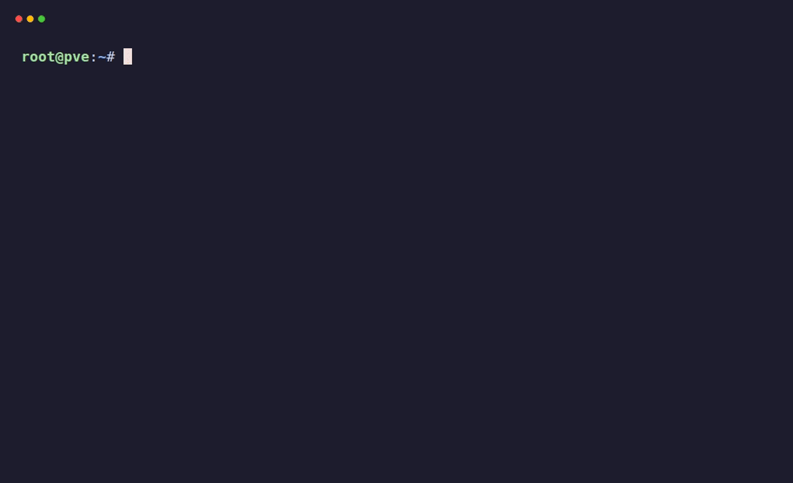
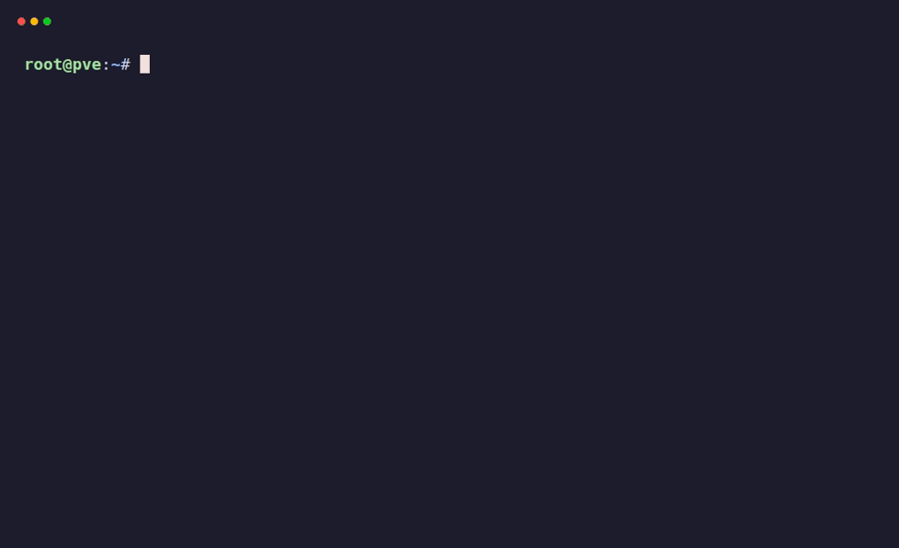

# Minecraft Server auf Proxmox – Version 3.0 (aktualisiert 2026-06-08)

> 🇬🇧 English version: [README.md](README.md)

<p align="center">
  
</p>

<p align="center">
  
  <br>
  <em>Echter Live-Verifikations- und Integritätstest des PaperMC-LXC-Containers (CT 120) auf Proxmox VE: Container-Status, systemd-Dienstprüfung, Live-Update-Check über die Fill-v3-API und Port-25565-Erreichbarkeit.</em>
</p>

[](https://github.com/TimInTech/minecraft-server-Proxmox/stargazers)
[](https://github.com/TimInTech/minecraft-server-Proxmox/fork)
[](LICENSE)
[](https://github.com/TimInTech/minecraft-server-Proxmox/releases/latest)
[](https://timintech.github.io/minecraft-server-Proxmox/de)
[](https://buymeacoffee.com/timintech)
[](README.md)

---

## ✨ Warum dieses Repo?

- 🚀 **Installation mit einem Befehl** — ein einziges Skript richtet in Minuten einen produktionsreifen Minecraft-Server (Java **oder** Bedrock) auf Proxmox ein.
- 🧩 **VM *und* LXC/CT** — unterstützt beide Proxmox-Virtualisierungsmodelle, inkl. fertigem CT-Helfer für Bedrock.
- 🔄 **Selbst-aktualisierend** — `update.sh` zieht den neuesten **stabilen** PaperMC-Build über die neue **Fill-v3-API** mit SHA256- + Größenprüfung.
- 🔒 **Sicher voreingestellt** — verifizierte Downloads, zufällige CT-Passwörter, UFW-Firewall-Anleitung und Integritätsprüfungen (keine HTML-Fehlerseiten als `server.jar`).
- 🧠 **Automatisch dimensionierter JVM-Speicher** — skaliert zum Host (`Xms ≈ RAM/4`, `Xmx ≈ RAM/2`, gedeckelt bei 16 G) — kein manuelles Tuning nötig.
- 🛡️ **CI-geprüft** — jedes Shell-Skript wird bei jedem Push mit ShellCheck geprüft.
- 🇩🇪🇬🇧 **Zweisprachige Doku** — vollständige deutsche und englische Dokumentation, synchron gehalten.

---

## 📑 Inhaltsverzeichnis

- [Voraussetzungen](#-voraussetzungen)
- [Einführung](#einführung)
- [Schnellstart](#schnellstart)
- [Backups](#-backups)
- [Auto-Update](#-auto-update)
- [Konfiguration](#konfiguration)
- [Integrität & Firewall](#integrität--firewall)
- [Proxmox-CT-Helfer (Bedrock)](#proxmox-ct-helfer-bedrock)
- [PaperMC-API-Migration (v2 → Fill v3)](#papermc-api-migration-v2--fill-v3)
- [Admin/Befehle](#-adminbefehle)
- [Fehlerbehebung](#fehlerbehebung)
- [Referenzen](#referenzen)

---

## Quick Links

- 🌐 **Interaktive Dokumentation & Guide:** <https://timintech.github.io/minecraft-server-Proxmox/de>
- Server-Befehle: [SERVER_COMMANDS.md](SERVER_COMMANDS.md)
- Simulations-Leitfaden: [SIMULATION.md](SIMULATION.md)
- Bedrock-Netzwerk: [docs/BEDROCK_NETWORKING.md](docs/BEDROCK_NETWORKING.md)
- Copilot-Workflow: [.github/copilot-instructions.md](.github/copilot-instructions.md)
- Issues — <https://github.com/TimInTech/minecraft-server-Proxmox/issues>

---

## Neu in v3.0

### Breaking Changes & kritische Fixes

- **PaperMC-API auf Fill v3 migriert** — Der alte Endpunkt `api.papermc.io/v2/` erhält seit dem 31. Dezember 2025 keine neuen Builds mehr und wird am 1. Juli 2026 vollständig abgeschaltet. Alle Skripte (`setup_minecraft.sh`, `setup_minecraft_lxc.sh`, eingebettetes `update.sh`) nutzen jetzt die neue REST-API `fill.papermc.io/v3/`. Dies behebt die Issues [#66](https://github.com/TimInTech/minecraft-server-Proxmox/issues/66), [#70](https://github.com/TimInTech/minecraft-server-Proxmox/issues/70) und [#71](https://github.com/TimInTech/minecraft-server-Proxmox/issues/71).
- **`jq`-Versionsfix** — Die neueste Minecraft-Version wird jetzt ermittelt, indem die Fill-v3-Versionsgruppen-Keys semantisch sortiert, die neueste Gruppe ausgewählt und daraus die neueste Patch-Version genommen wird (`.versions as $v | (… sort | last …) as $g | $v[$g][0]`). Das behebt sowohl `Cannot index object with number`-Fehler **als auch** die `curl: (22) 404`-Fehler, die auftraten, wenn die bisherige Logik einen reinen Gruppen-Key (z. B. `26.1`) statt einer echten Version (z. B. `26.1.2`) zurückgab. Behebt [#71](https://github.com/TimInTech/minecraft-server-Proxmox/issues/71) und [#74](https://github.com/TimInTech/minecraft-server-Proxmox/issues/74).
- **User-Agent-Header erforderlich** — Fill v3 lehnt Anfragen ohne gültigen `User-Agent` ab oder drosselt sie. Alle API-Aufrufe enthalten jetzt `minecraft-server-Proxmox/<version>`.
- **Download-URLs in API-Antwort eingebettet** — Downloads kommen jetzt von `fill-data.papermc.io`. URLs werden nicht mehr manuell konstruiert, sondern direkt aus der API-Antwort gelesen.
- **Filterung auf Stable-Channel** — Die neue API liefert Builds über mehrere Channels (alpha, beta, stable, recommended). Die Skripte filtern jetzt auf `channel == "STABLE"`, um keine experimentellen Builds zu ziehen.

### Weitere Verbesserungen

- **LXC-Skript: `screen`-Unterstützung ergänzt** — `setup_minecraft_lxc.sh` installiert jetzt `screen`, legt das Socket-Verzeichnis `/run/screen` an und startet den Server in einer Screen-Session (konsistent mit dem VM-Skript und der README). Behebt Issue [#67](https://github.com/TimInTech/minecraft-server-Proxmox/issues/67).
- **Bedrock-SHA-Default auf 0 geändert** — `REQUIRE_BEDROCK_SHA` ist jetzt standardmäßig `0`. Mojang veröffentlicht keine Upstream-Prüfsummen, daher war der bisherige Default `1` ein für alle Nutzer unlösbarer Blocker. Der SHA256 wird weiterhin berechnet und zur manuellen Prüfung ausgegeben.
- **CT-Helfer: zufälliges Passwort** — `proxmox_create_ct_bedrock.sh` erzeugt jetzt ein zufälliges 16-stelliges alphanumerisches Passwort für das CT-Root-Konto (am Ende des Setups ausgegeben). Das hartkodierte `changeme` wurde entfernt.
- **Hinweis zur Minecraft-Versionierung** — Ab 2026 verwendet Mojang ein neues Versionsschema (`26.1` statt `1.x.x`). Die Skripte handhaben das transparent, da sie immer die neueste Version aus der API ziehen.
- **Java-Badge korrigiert** — Java 21 ist die Mindestvoraussetzung (Java 17 reicht für aktuelle PaperMC-Builds nicht mehr aus).
- **Bedrock-Regex aktualisiert** — Das URL-Scraping-Muster erkennt jetzt auch das neue `26.x`-Versionsschema, das seit Februar 2026 verwendet wird.
- **Fix für Dateibesitz** — `eula.txt` und andere generierte Dateien werden jetzt von Anfang an mit korrektem Besitzer angelegt.

---

## ✅ Voraussetzungen

- Proxmox VE: 7.4+ / 8.x / 9.x
- Gast-OS: Debian 12/13 oder Ubuntu 22.04 / 24.04
- CPU/RAM: ≥2 vCPU, ≥2–4 GB RAM (Java), ≥1–2 GB (Bedrock)
- Speicher: ≥10 GB SSD
- Netzwerk: Bridged NIC (vmbr0), Ports 25565/TCP und 19132/UDP

Java 21 ist erforderlich. Fehlt OpenJDK 21 in deinen Repositories, greifen die Installer automatisch auf Amazon Corretto 21 zurück (APT mit signiertem Keyring).
**Hinweis:** UFW muss installiert sein, bevor `ufw`-Befehle ausgeführt werden. Der JVM-Speicher wird vom Installer automatisch dimensioniert (siehe unten).

---

## Einführung

Dieses Repository richtet in wenigen Minuten einen performanten Minecraft-Server (Java & Bedrock) auf Proxmox ein. VM und LXC werden unterstützt. Enthalten sind CLI-orientiertes Setup, Updater und Backup-Beispiele.

> Nur Simulation: Führe in diesem Workspace keine Befehle aus. Siehe SIMULATION.md.

## Technologien & Abhängigkeiten

[](https://pve.proxmox.com/)
[](https://www.debian.org/)
[](https://ubuntu.com/)
[](https://openjdk.org/)
[](https://www.minecraft.net/)
[](https://www.gnu.org/software/bash/)
[](https://systemd.io/)
[](https://www.gnu.org/software/screen/)

## 📊 Status

Stabil. VM und LXC getestet. PaperMC-API auf Fill v3 aktualisiert (März 2026). Bedrock-Updates bleiben manuell.

## Schnellstart

### VM (DHCP)

```bash
wget https://raw.githubusercontent.com/TimInTech/minecraft-server-Proxmox/main/setup_minecraft.sh
chmod +x setup_minecraft.sh
./setup_minecraft.sh
sudo -u minecraft screen -r minecraft
```

> Debian 12/13: Stelle sicher, dass `/run/screen` mit `root:utmp` und Modus `0775` existiert (siehe unten).

### VM (statische IP)

```bash
sudo tee /etc/netplan/01-mc.yaml >/dev/null <<'YAML'
network:
  version: 2
  ethernets:
    ens18:
      addresses: [192.168.1.50/24]
      routes: [{ to: default, via: 192.168.1.1 }]
      nameservers: { addresses: [1.1.1.1,8.8.8.8] }
YAML
sudo netplan apply
```

### LXC/CT

```bash
wget https://raw.githubusercontent.com/TimInTech/minecraft-server-Proxmox/main/setup_minecraft_lxc.sh
chmod +x setup_minecraft_lxc.sh
./setup_minecraft_lxc.sh
sudo -u minecraft screen -r minecraft
```

### Bedrock

```bash
wget https://raw.githubusercontent.com/TimInTech/minecraft-server-Proxmox/main/setup_bedrock.sh
chmod +x setup_bedrock.sh
./setup_bedrock.sh
sudo -u minecraft screen -r bedrock
```

## 🗃 Backups

### Option A: systemd

```bash
sudo tee /etc/mc_backup.conf >/dev/null <<'EOF'
MC_SRC_DIR=/opt/minecraft
MC_BEDROCK_DIR=/opt/minecraft-bedrock
BACKUP_DIR=/var/backups/minecraft
RETAIN_DAYS=7
EOF

sudo tee /etc/systemd/system/mc-backup.service >/dev/null <<'EOF'
[Unit]
Description=Minecraft backup (tar)
[Service]
Type=oneshot
EnvironmentFile=/etc/mc_backup.conf
ExecStart=/bin/mkdir -p "${BACKUP_DIR}"
ExecStart=/bin/bash -c 'tar -czf "${BACKUP_DIR}/java-$(date +%%F).tar.gz" "${MC_SRC_DIR}"'
ExecStart=/bin/bash -c '[ -d "${MC_BEDROCK_DIR}" ] && tar -czf "${BACKUP_DIR}/bedrock-$(date +%%F).tar.gz" "${MC_BEDROCK_DIR}" || true'
ExecStartPost=/bin/bash -c 'find "${BACKUP_DIR}" -type f -name "*.tar.gz" -mtime +"${RETAIN_DAYS:-7}" -delete'
EOF

sudo tee /etc/systemd/system/mc-backup.timer >/dev/null <<'EOF'
[Unit]
Description=Nightly Minecraft backup
[Timer]
OnCalendar=*-*-* 03:30:00
Persistent=true
[Install]
WantedBy=timers.target
EOF

sudo systemctl daemon-reload
sudo systemctl enable --now mc-backup.timer
```

### Option B: cron

```bash
crontab -e
30 3 * * * tar -czf /var/backups/minecraft/mc-$(date +\%F).tar.gz /opt/minecraft
45 3 * * * tar -czf /var/backups/minecraft/bedrock-$(date +\%F).tar.gz /opt/minecraft-bedrock
```

## ♻ Auto-Update

Java Edition: `update.sh` (erstellt von `setup_minecraft.sh`) lädt den neuesten stabilen PaperMC-Build über die Fill-v3-API mit SHA256- und Größenprüfung.

```bash
cd /opt/minecraft && ./update.sh
crontab -e
0 4 * * 0 /opt/minecraft/update.sh >> /var/log/minecraft-update.log 2>&1
```

> Bedrock erfordert einen manuellen Download. Führe `setup_bedrock.sh` erneut aus, um zu aktualisieren.

## Konfiguration

### JVM-Speicher (Java)

Der Installer setzt `Xms ≈ RAM/4` und `Xmx ≈ RAM/2` mit Untergrenzen `1024M/2048M` und einer `Xmx`-Obergrenze von `≤16G`. Überschreiben in `/opt/minecraft/start.sh`.

## Integrität & Firewall

**Java (PaperMC):**

- Der Paper-Download wird per **SHA256** aus der Fill-v3-API-Antwort verifiziert.
- Mindestgröße `server.jar > 5 MB`, um das Speichern von HTML-Fehlerseiten zu vermeiden.
- Es werden nur Builds des **STABLE**-Channels heruntergeladen (alpha/beta/experimental ausgeschlossen).

**Bedrock:**

| Modus | Verwendung | Verhalten |
|---|---|---|
| Standard (`REQUIRE_BEDROCK_SHA=0`) | Einfach `setup_bedrock.sh` ausführen | SHA256 wird berechnet und ausgegeben; kein vorgegebener Wert nötig. |
| Strikt (`REQUIRE_BEDROCK_SHA=1`) | Vor dem Ausführen `export REQUIRED_BEDROCK_SHA256=<sha>` | Das Skript bricht ab, wenn der berechnete SHA nicht passt. |

Mojang veröffentlicht keine Upstream-Prüfsummen. Um einen bekannten guten Wert festzuhalten: einmal im Standardmodus ausführen, den ausgegebenen SHA notieren, dann `REQUIRED_BEDROCK_SHA256` für künftige Läufe setzen.

Zusätzlich validiert der Installer den MIME-Typ per HTTP HEAD (`application/zip|octet-stream`), prüft die Größe (>1 MB) und testet das ZIP mit `unzip -tq` vor dem Entpacken.

**screen-Socket (Debian 12/13):**

```bash
sudo install -d -m 0775 -o root -g utmp /run/screen
printf 'd /run/screen 0775 root utmp -\n' | sudo tee /etc/tmpfiles.d/screen.conf
sudo systemd-tmpfiles --create /etc/tmpfiles.d/screen.conf
```

> **LXC-Hinweis:** In unprivilegierten LXC-Containern existiert die Gruppe `utmp` möglicherweise nicht. Die Skripte fangen das ab, indem sie bei Bedarf auf `root:root` mit Modus `0777` zurückfallen.

**UFW:**

```bash
sudo apt-get install -y ufw
sudo ufw allow 25565/tcp
sudo ufw allow 19132/udp
sudo ufw enable
```

## Proxmox-CT-Helfer (Bedrock)

`scripts/proxmox_create_ct_bedrock.sh` erstellt einen Debian-12-Container und installiert Bedrock automatisch.

```bash
bash scripts/proxmox_create_ct_bedrock.sh
```

Am Ende wird ein zufälliges 16-stelliges Root-Passwort erzeugt und ausgegeben. **Ändere es sofort** nach dem ersten Login:

```bash
pct exec 121 -- passwd root
```

Standardwerte über Umgebungsvariablen überschreiben:

```bash
STORE=local CTID=122 MEM=4096 bash scripts/proxmox_create_ct_bedrock.sh
```

## PaperMC-API-Migration (v2 → Fill v3)

Wenn du eine bestehende Installation mit dem alten Endpunkt `api.papermc.io/v2/` hast, führe das Setup-Skript erneut aus oder aktualisiere dein `update.sh` in `/opt/minecraft/` manuell. Die wichtigsten Änderungen:

| Aspekt | Alt (v2) | Neu (Fill v3) |
|---|---|---|
| Basis-URL | `api.papermc.io/v2/projects/paper` | `fill.papermc.io/v3/projects/paper` |
| Versionsfeld | Array → `.versions \| last` | Objekt → `.versions \| .[<neueste Gruppe>][0]` |
| Build-Auswahl | `jq '.builds \| last'` | `jq 'map(select(.channel=="STABLE")) \| .[0]'` |
| Download-URL | Manuell konstruiert | Eingebettet in `.downloads."server:default".url` |
| SHA256 | `.downloads.application.sha256` | `.downloads."server:default".checksums.sha256` |
| User-Agent | Nicht erforderlich | **Erforderlich** (ohne abgelehnt/gedrosselt) |
| Abschaltung | 1. Juli 2026 | Aktiv und unterstützt |

## 🕹 Admin & Server-Verwaltung

<p align="center">
  
  <br>
  <em>Praktische Server-Administration nach der Installation: Prüfung von systemd-Status &amp; Speicherallokation, Konfigurations-Audit der <code>server.properties</code>, automatisierte komprimierte World-Backups und Live-Log-Überwachung.</em>
</p>

Ausführliche In-Game- und Konsolenbefehle, Operator-Einrichtung, Whitelist-Verwaltung und Command-Blocks findest du in **[SERVER_COMMANDS.md](SERVER_COMMANDS.md)**.

## ☕ Support / Spenden

Wenn dir dieses Projekt Zeit spart, unterstütze die weitere Pflege gerne über [Buy Me A Coffee](https://buymeacoffee.com/timintech).

## Fehlerbehebung

- **`jq: Cannot index object with number`** → Alter `.versions | last`-Bug. Lade das Skript erneut von `main` herunter.
- **PaperMC-Download schlägt mit 404 fehl (`curl: (22) ... 404`)** → Entweder nutzt du noch die alte v2-API, oder du hast ein älteres Fill-v3-Skript, dessen Versionslogik einen reinen Versionsgruppen-Key (z. B. `26.1`) statt einer echten Version (z. B. `26.1.2`) zurückgab, wodurch die `/versions/<v>/builds`-Anfrage einen 404 ergab. Lade das Skript erneut von `main` herunter (behoben in [#74](https://github.com/TimInTech/minecraft-server-Proxmox/issues/74)).
- **Zu wenig RAM im LXC** → Werte in `start.sh` reduzieren.
- **Fehlendes `/run/screen`** → Folge dem Abschnitt „screen-Socket" oben.
- **`/run/screen` mit Modus 777 im LXC** → In unprivilegierten Containern existiert `utmp` möglicherweise nicht. Verwende `chmod 0777 /run/screen` oder stelle sicher, dass die Gruppe `utmp` gemappt ist.
- **Bedrock-ZIP-MIME-Typ-Problem** → Besuche die Mojang-Download-Seite erneut.
- **Java 17 funktioniert nicht mehr** → PaperMC 1.21.8+ benötigt Java 21. Führe den Installer erneut aus, um den Corretto-21-Fallback zu erhalten.
- **Bedrock-SHA-Mismatch mit `REQUIRE_BEDROCK_SHA=1`** → Mojang veröffentlicht keine Upstream-Prüfsummen. Führe einmal mit `REQUIRE_BEDROCK_SHA=0` aus, notiere den ausgegebenen SHA, dann setze `REQUIRED_BEDROCK_SHA256`.

Verwende die PR-Vorlage. Führe in diesem Workspace nichts aus. Siehe **[.github/copilot-instructions.md](.github/copilot-instructions.md)**.

Details zum sicheren Simulations-Workflow findest du in **[SIMULATION.md](SIMULATION.md)**.

> **Simulations-CLI:** Für den schrittweisen Copilot-CLI-Workflow siehe [.github/copilot-instructions.md](.github/copilot-instructions.md).

## Referenzen

- PaperMC: <https://papermc.io/>
- PaperMC Fill v3 API-Doku: <https://docs.papermc.io/misc/downloads-service/>
- PaperMC Fill v3 Swagger: <https://fill.papermc.io/swagger-ui/index.html>
- Proxmox-Wiki: <https://pve.proxmox.com/wiki/Main_Page>
- Mojang Bedrock Server: <https://www.minecraft.net/en-us/download/server/bedrock>

## ⭐ Star-Verlauf

Wenn dir dieses Projekt Zeit gespart hat: Ein ⭐ hilft anderen, es zu finden, und motiviert zur weiteren Pflege.

[](https://star-history.com/#TimInTech/minecraft-server-Proxmox&Date)

## Lizenz

[MIT](LICENSE)
