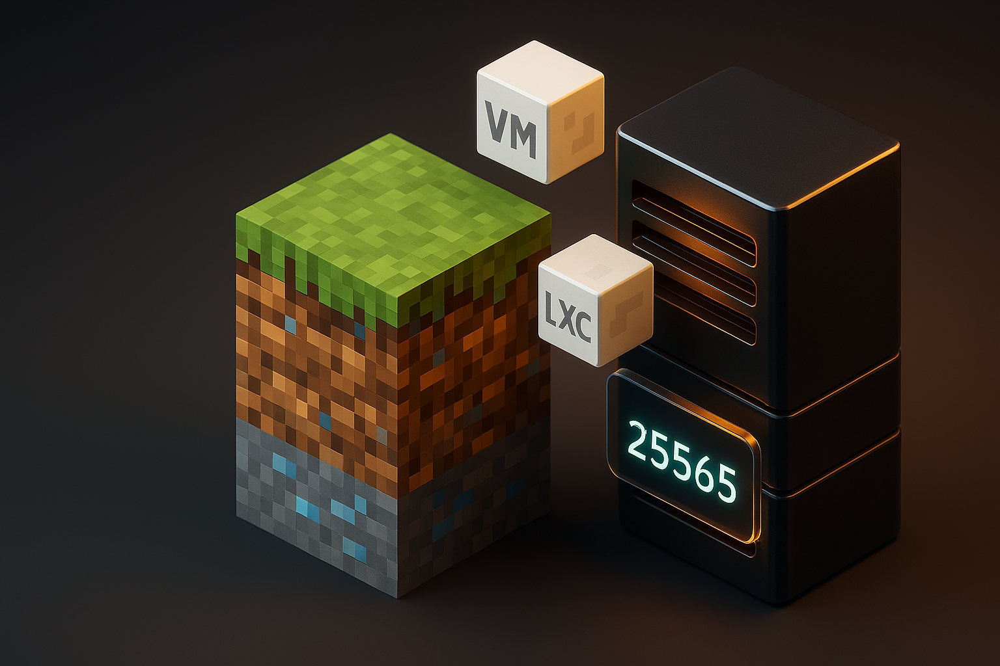

# Minecraft Server on Proxmox – Version 2.0 (updated 2025-11-08)



<p align="center"><em>Minecraft Server on Proxmox</em></p>

<p align="center">
  <a href="https://github.com/TimInTech/minecraft-server-Proxmox/stargazers"></a>
  <a href="https://github.com/TimInTech/minecraft-server-Proxmox/fork"></a>
  <a href="LICENSE"></a>
  <a href="https://github.com/TimInTech/minecraft-server-Proxmox/releases/latest"></a>
  <a href="https://buymeacoffee.com/timintech"></a>
</p>

---

## Quick Links

- Server Commands: [SERVER_COMMANDS.md](SERVER_COMMANDS.md)
- Simulation Guide: [SIMULATION.md](SIMULATION.md)
- Bedrock Networking: [docs/BEDROCK_NETWORKING.md](docs/BEDROCK_NETWORKING.md)
- Copilot Workflow: [.github/copilot-instructions.md](.github/copilot-instructions.md)
- Issues — https://github.com/TimInTech/minecraft-server-Proxmox/issues

---

## ✅ Requirements

- Proxmox VE: 7.4+ / 8.x / 9.x
- Guest OS: Debian 12/13 or Ubuntu 24.04
- CPU/RAM: ≥2 vCPU, ≥2–4 GB RAM (Java), ≥1–2 GB (Bedrock)
- Storage: ≥10 GB SSD
- Network: Bridged NIC (vmbr0), ports 25565/TCP and 19132/UDP

Java 21 is required. If OpenJDK 21 is missing in your repositories, the installers automatically fall back to Amazon Corretto 21 (APT with signed-by keyring).
**Note:** UFW must be installed before running any `ufw` commands. JVM memory is auto-sized by the installer (see below). Bedrock installer enforces SHA256 checksum by default.

---

## Introduction

This repository provisions a performant Minecraft server (Java & Bedrock) on Proxmox in minutes. VM and LXC are supported. CLI-first setup, updater, and backup examples are provided.

> Simulation only: Do not execute commands in this workspace. See SIMULATION.md.

## Technologies & Dependencies


## 📊 Status

Stable. VM and LXC tested. Bedrock updates remain manual.

## Quickstart

### VM (DHCP)

```bash
wget https://raw.githubusercontent.com/TimInTech/minecraft-server-Proxmox/main/setup_minecraft.sh
chmod +x setup_minecraft.sh
./setup_minecraft.sh
sudo -u minecraft screen -r minecraft
```

> Debian 12/13: Ensure `/run/screen` exists with `root:utmp` and mode `0775` (see below).

### VM (Static IP)

```bash
sudo tee /etc/netplan/01-mc.yaml >/dev/null <<'YAML'
network:
  version: 2
  ethernets:
    ens18:
      addresses: [192.168.1.50/24]
      routes: [{ to: default, via: 192.168.1.1 }]
      nameservers: { addresses: [1.1.1.1,8.8.8.8] }
YAML
sudo netplan apply
```

### LXC/CT

```bash
wget https://raw.githubusercontent.com/TimInTech/minecraft-server-Proxmox/main/setup_minecraft_lxc.sh
chmod +x setup_minecraft_lxc.sh
./setup_minecraft_lxc.sh
sudo -u minecraft screen -r minecraft
```

### Bedrock

```bash
wget https://raw.githubusercontent.com/TimInTech/minecraft-server-Proxmox/main/setup_bedrock.sh
chmod +x setup_bedrock.sh
./setup_bedrock.sh
sudo -u minecraft screen -r bedrock
```

## 🗃 Backups

### Option A: systemd

```bash
sudo tee /etc/mc_backup.conf >/dev/null <<'EOF'
MC_SRC_DIR=/opt/minecraft
MC_BEDROCK_DIR=/opt/minecraft-bedrock
BACKUP_DIR=/var/backups/minecraft
RETAIN_DAYS=7
EOF

sudo tee /etc/systemd/system/mc-backup.service >/dev/null <<'EOF'
[Unit]
Description=Minecraft backup (tar)
[Service]
Type=oneshot
EnvironmentFile=/etc/mc_backup.conf
ExecStart=/bin/mkdir -p "${BACKUP_DIR}"
ExecStart=/bin/bash -c 'tar -czf "${BACKUP_DIR}/java-$(date +%%F).tar.gz" "${MC_SRC_DIR}"'
ExecStart=/bin/bash -c '[ -d "${MC_BEDROCK_DIR}" ] && tar -czf "${BACKUP_DIR}/bedrock-$(date +%%F).tar.gz" "${MC_BEDROCK_DIR}" || true'
ExecStartPost=/bin/bash -c 'find "${BACKUP_DIR}" -type f -name "*.tar.gz" -mtime +"${RETAIN_DAYS:-7}" -delete'
EOF

sudo tee /etc/systemd/system/mc-backup.timer >/dev/null <<'EOF'
[Unit]
Description=Nightly Minecraft backup
[Timer]
OnCalendar=*-*-* 03:30:00
Persistent=true
[Install]
WantedBy=timers.target
EOF

sudo systemctl daemon-reload
sudo systemctl enable --now mc-backup.timer
```

### Option B: cron

```bash
crontab -e
30 3 * * * tar -czf /var/backups/minecraft/mc-$(date +\%F).tar.gz /opt/minecraft
45 3 * * * tar -czf /var/backups/minecraft/bedrock-$(date +\%F).tar.gz /opt/minecraft-bedrock
```

## ♻ Auto-Update

Java Edition: `update.sh` (created by `setup_minecraft.sh`) pulls the latest PaperMC build with SHA256 and size validation.

```bash
cd /opt/minecraft && ./update.sh
crontab -e
0 4 * * 0 /opt/minecraft/update.sh >> /var/log/minecraft-update.log 2>&1
```
> Bedrock requires a manual download. `setup_bedrock.sh` enforces SHA256 by default (see below).
> **Checksum enforcement:** Bedrock installer requires `REQUIRED_BEDROCK_SHA256` and validates the ZIP before extraction.
## Configuration

### JVM memory (Java)


The installer sets `Xms ≈ RAM/4` and `Xmx ≈ RAM/2` with floors `256M/448M` and an `Xmx` cap of `≤16G`. Override in `/opt/minecraft/start.sh`.

## Integrity & Firewall

**Java (PaperMC):**

- Paper download is verified via **SHA256** in installer/updater.
- Minimum size `server.jar > 5 MB` to avoid saving HTML error pages.

**Bedrock:**

- Default: `REQUIRE_BEDROCK_SHA=1`. Set `REQUIRED_BEDROCK_SHA256=<sha>`. Override with `REQUIRE_BEDROCK_SHA=0`.
- The installer validates MIME type via HTTP HEAD (application/zip|octet-stream), checks size, and tests the ZIP via `unzip -tq` before extracting.

**screen socket (Debian 12/13):**

```bash
sudo install -d -m 0775 -o root -g utmp /run/screen
printf 'd /run/screen 0775 root utmp -\n' | sudo tee /etc/tmpfiles.d/screen.conf
sudo systemd-tmpfiles --create /etc/tmpfiles.d/screen.conf
```

**UFW:**

```bash
sudo apt-get install -y ufw
sudo ufw allow 25565/tcp
sudo ufw allow 19132/udp
sudo ufw enable
```

## 🕹 Admin/Commands

See **[SERVER_COMMANDS.md](SERVER_COMMANDS.md)**.

## ☕ Support / Donate

If this project saves you time, consider supporting continued maintenance via [Buy Me A Coffee](https://buymeacoffee.com/timintech).

## Troubleshooting

- Not enough RAM in LXC → reduce values in `start.sh`.
- Missing `/run/screen` → follow the "screen socket" section above.
- Bedrock ZIP MIME-Type issue → revisit the Mojang download page.

Use the PR template. Do not execute anything in this workspace. See **[.github/copilot-instructions.md](.github/copilot-instructions.md)**.

For safe simulation workflow details, see **[SIMULATION.md](SIMULATION.md)**.

> **Simulation CLI:** For step-by-step Copilot CLI workflow, see [.github/copilot-instructions.md](.github/copilot-instructions.md).


## References

- PaperMC: [https://papermc.io/](https://papermc.io/)
- Proxmox Wiki: [https://pve.proxmox.com/wiki/Main_Page](https://pve.proxmox.com/wiki/Main_Page)
- Mojang Bedrock Server: [https://www.minecraft.net/en-us/download/server/bedrock](https://www.minecraft.net/en-us/download/server/bedrock)

## License

[MIT](LICENSE)

> Proxmox Helper: `scripts/proxmox_create_ct_bedrock.sh` creates a Debian 12/13 container and installs Bedrock.
